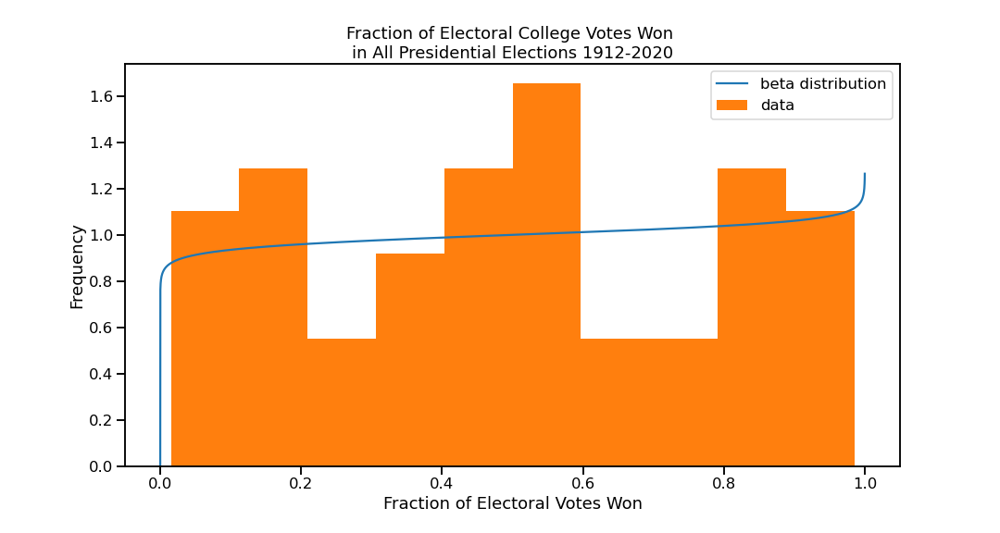
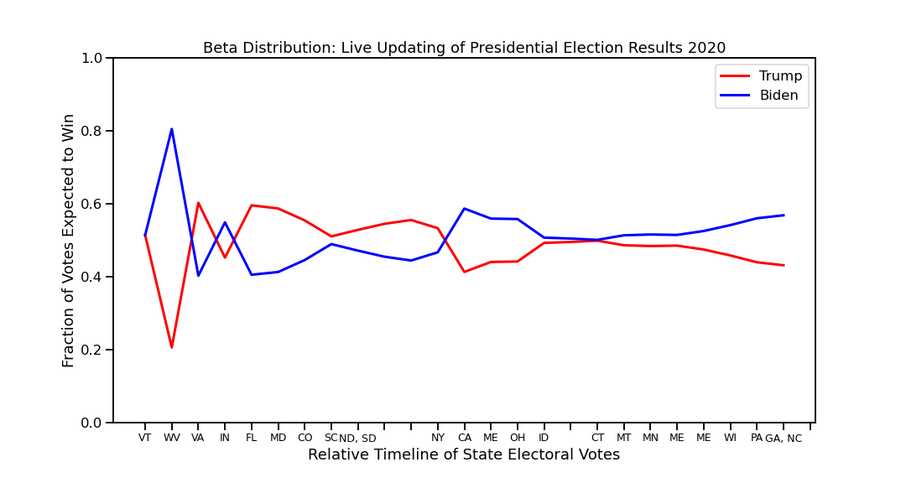

# presidential-beta-distributions
Beta distributions model each candidate's probability of winning as electoral votes come in for the 2020 presidential election.

## Sources
This [youtube video](https://www.youtube.com/watch?v=VV5NM3gogD8) for 2020 state voting data.

This [site](https://www.270towin.com/2020_Election/) for historical voting data.
